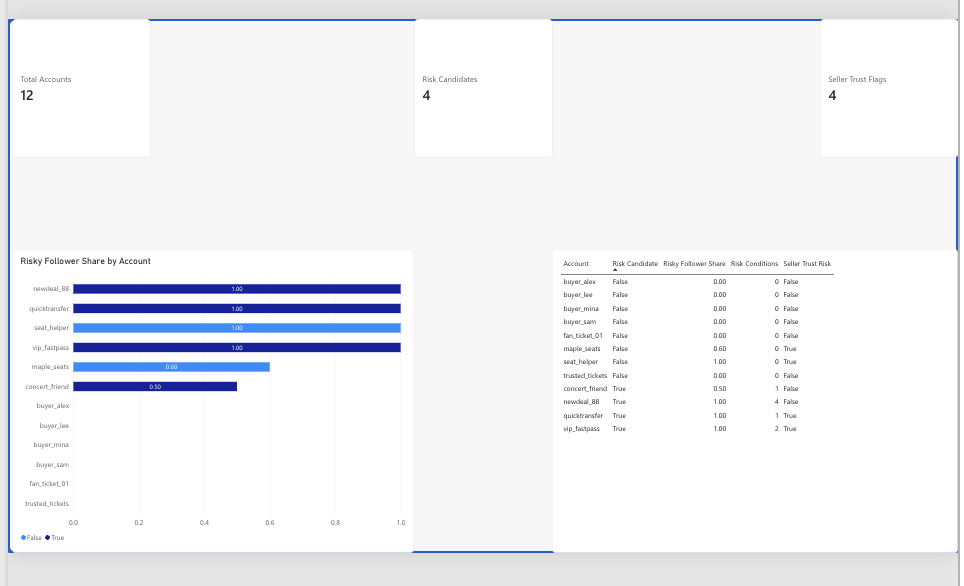

# Ticket Resale Account Risk Screening Tool
## Live Demo

[Open the Ticket Account Risk Screener](https://ticket-account-risk-screener.mmmlinda1111.chatgpt.site)

Upload account activity and follower relationship files, or run the built-in fictional dataset directly in your browser. No Python installation is required.

This beginner-friendly Python project screens accounts on a fictional ticket
resale marketplace. It uses account activity and follower-network patterns to
identify accounts with unusual behaviour and sellers whose apparent popularity
may be supported mainly by high-risk accounts.

## Motivation

Peer-to-peer ticket marketplaces depend heavily on seller reputation. A seller
may appear trustworthy because many accounts follow them, but that signal is
less meaningful when most of those followers also show unusual behaviour. This
project demonstrates an explainable, rules-based way to prioritize accounts for
manual review. It does not determine that any account has committed fraud.

## How it works

1. Read account activity from `data/accounts.csv` into a nested dictionary.
2. Add follower and following relationships from `data/connections.csv`.
3. Count reciprocal connections for every account.
4. Calculate activity thresholds using quantiles from the dataset.
5. Assign one or more explainable risk groups to accounts meeting the rules.
6. Find sellers whose followers are more than 50% risk candidates.
7. Rank candidates and sellers with a manually implemented selection sort.
8. Export two flat CSV tables that can be loaded into Power BI.

## Risk groups

- High messages with low listings
- High messages with low mutual connections
- High messages from a recently created account
- High following count with a low follower count

These are screening indicators for demonstration, not proof of fraud.

## Run

From the project directory:

```bash
python ticket_account_risk.py
python -m unittest discover -s tests
```

The project uses only the Python standard library.

Running the script also creates these files in `output/`:

- `power_bi_account_risk_summary.csv`
- `power_bi_risk_group_details.csv`

## Browser demo

Open `docs/index.html` in a browser to use the screening interface without
installing Python. The page includes the fictional sample dataset and also
accepts two local CSV files with the same columns as the files in `data/`.
Uploaded files are processed entirely in the browser and are not sent to a
server.

## Power BI report



The dashboard summarizes 12 fictional marketplace accounts, including four
risk candidates and four seller-trust flags. The account-level bar chart shows
the share of risky followers, while the accompanying table keeps the screening
result and number of triggered risk conditions visible for review.

The two files in `output/` are prepared for a simple Power BI data model. Load
both CSV files, then create a one-to-many relationship from
`power_bi_account_risk_summary[account_id]` to
`power_bi_risk_group_details[account_id]`.

A useful one-page report can include:

- cards for total accounts, risk candidates, seller trust flags, and candidate
  rate;
- a table of flagged accounts sorted by `risk_group_count`;
- a bar chart showing the number of accounts in each `risk_group`;
- a scatter plot comparing `num_listings` and `num_messages`;
- filters for candidate status, seller trust status, and account creation date.

Suggested DAX measures:

```text
Total Accounts =
DISTINCTCOUNT(power_bi_account_risk_summary[account_id])

Risk Candidates =
CALCULATE(
    [Total Accounts],
    power_bi_account_risk_summary[is_risk_candidate] = TRUE()
)

Candidate Rate =
DIVIDE([Risk Candidates], [Total Accounts])

Seller Trust Flags =
CALCULATE(
    [Total Accounts],
    power_bi_account_risk_summary[is_seller_trust_risk] = TRUE()
)
```

The report visualizes the existing screening rules. It does not add a new risk
score or change which accounts are flagged.

### Mac browser workflow

Power BI Desktop requires Windows. On a Mac, upload
`output/power_bi_account_risk_summary.csv` to the Power BI service and build the
first report from that table alone. It supports the four cards, flagged-account
table, listings-versus-messages scatter plot, and account-status filters. The
second CSV is optional and can be added later when working in Power BI Desktop
or another environment that supports editing the two-table data model.

## Skills demonstrated

- CSV file processing
- Nested dictionaries and lists
- Relationship-network analysis
- Quantile-based thresholds
- Rule-based risk classification
- Filtering and manual sorting
- Unit testing
- Power BI data preparation and reporting

## Data

All accounts and relationships are fictional and were created only for this
educational demonstration.
